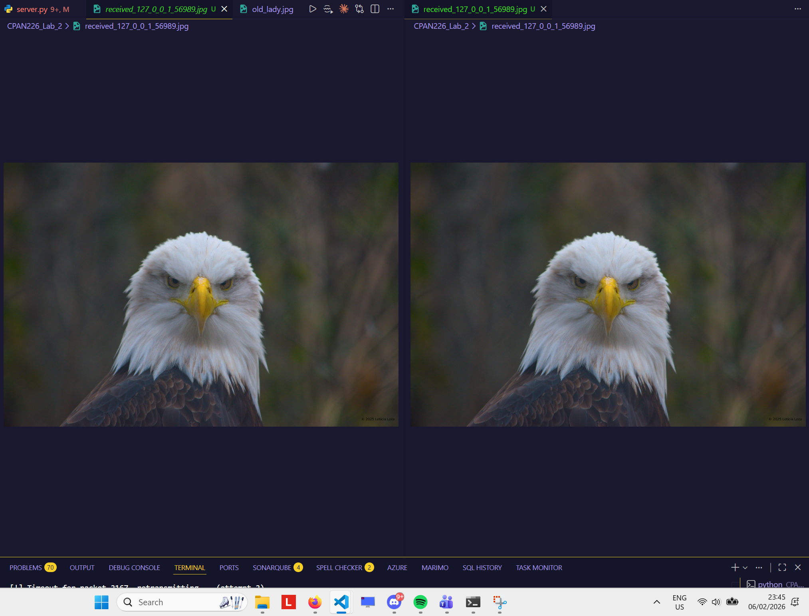
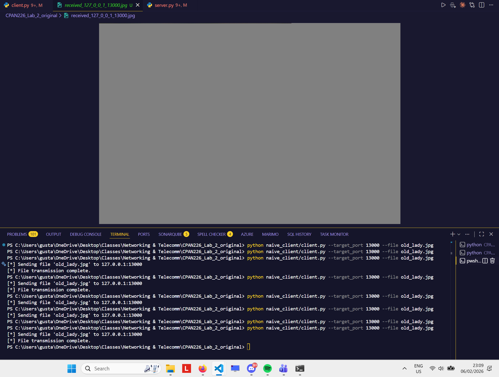
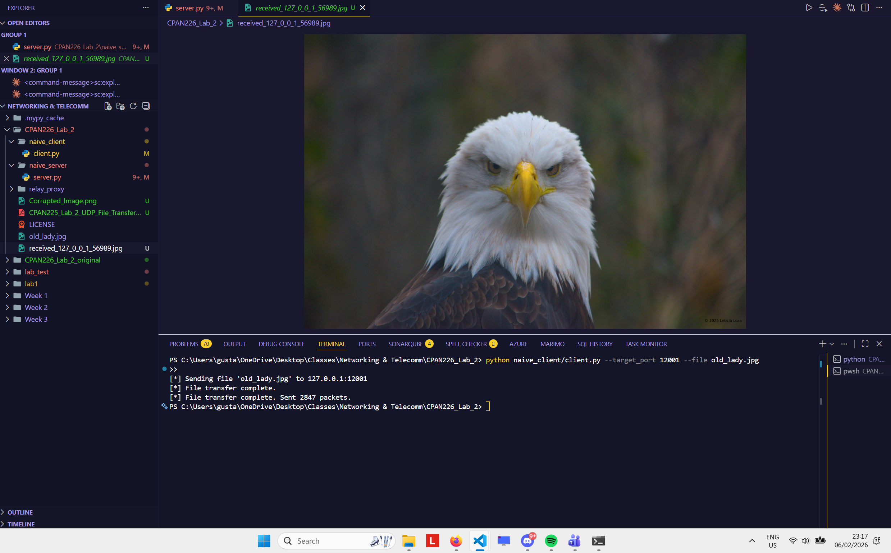
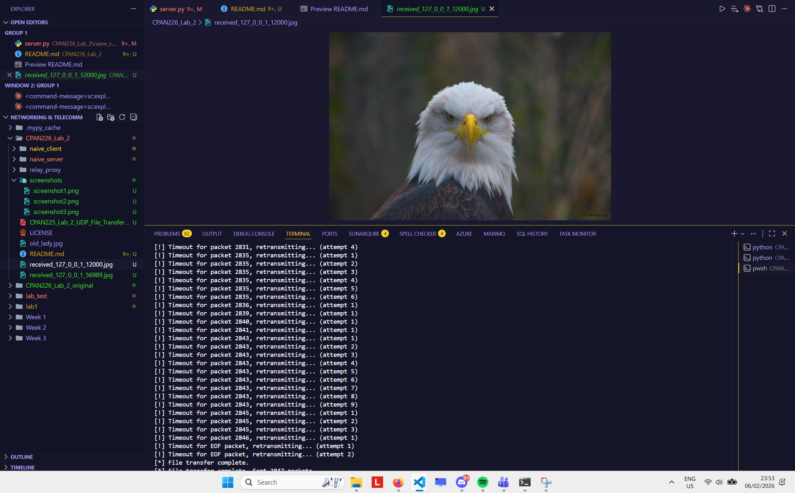

# CPAN 226 - Lab 2: Reliable Transport over UDP

**Modified by:** Gustavo Guidini Salerno / N01648740

## Overview

This lab upgrades a naive UDP file transfer system to handle packet loss and out-of-order delivery by implementing Stop-and-Wait ARQ and a server-side reordering buffer.

## Screenshots

### Screenshot 1: Direct Connection (No Relay)
The original image (`old_lady.jpg`) and the received file transferred directly from client to server without the relay. Both images are identical, proving the basic transfer logic works.



### Screenshot 2: Corrupted Image (Original Code Through Relay)
The received image after sending through the relay with 20% reordering using the unmodified starter code. The image is corrupted (grey bars, color shifts) because bytes arrived out of order.



### Screenshot 3: Clean Image After Fix (Through Relay)
The received image after sending through the relay with 30% loss and 20% reordering using the modified code. The image is a perfect copy of the original, proving both fixes work.



### Screenshot 4: Final Check Terminal Output
Terminal output from the final test (`--loss 0.3 --reorder 0.2`) showing successful retransmissions and file transfer completion.



## How the Buffer Logic Works

The server maintains an `expected_seq_num` counter starting at 0 and a `buffer` dictionary that stores out-of-order packets. When a packet arrives, the server extracts its sequence number from the 4-byte header and sends an ACK back immediately. If the packet's sequence number matches `expected_seq_num`, the server writes its payload directly to the file and increments the expected counter. It then checks if the next expected sequence number is already in the buffer (from a previously received out-of-order packet), and if so, writes those consecutive buffered packets to the file as well, continuing until a gap is found. If a packet arrives with a sequence number greater than expected, it is stored in the buffer dictionary for later. If it arrives with a sequence number less than expected, it is a duplicate (already written) and is safely ignored since the ACK was already sent. This ensures the file is always written in the correct byte order regardless of how the network shuffled the packets.

## Testing Commands

### Test A: Direct Connection
```
python naive_server/server.py --port 12001
python naive_client/client.py --target_port 12001 --file old_lady.jpg
```

### Test B: Through Relay (Final Check)
```
python naive_server/server.py --port 12001
python relay_proxy/relay.py --bind_port 12000 --server_port 12001 --loss 0.3 --reorder 0.2
python naive_client/client.py --target_port 12000 --file old_lady.jpg
```
